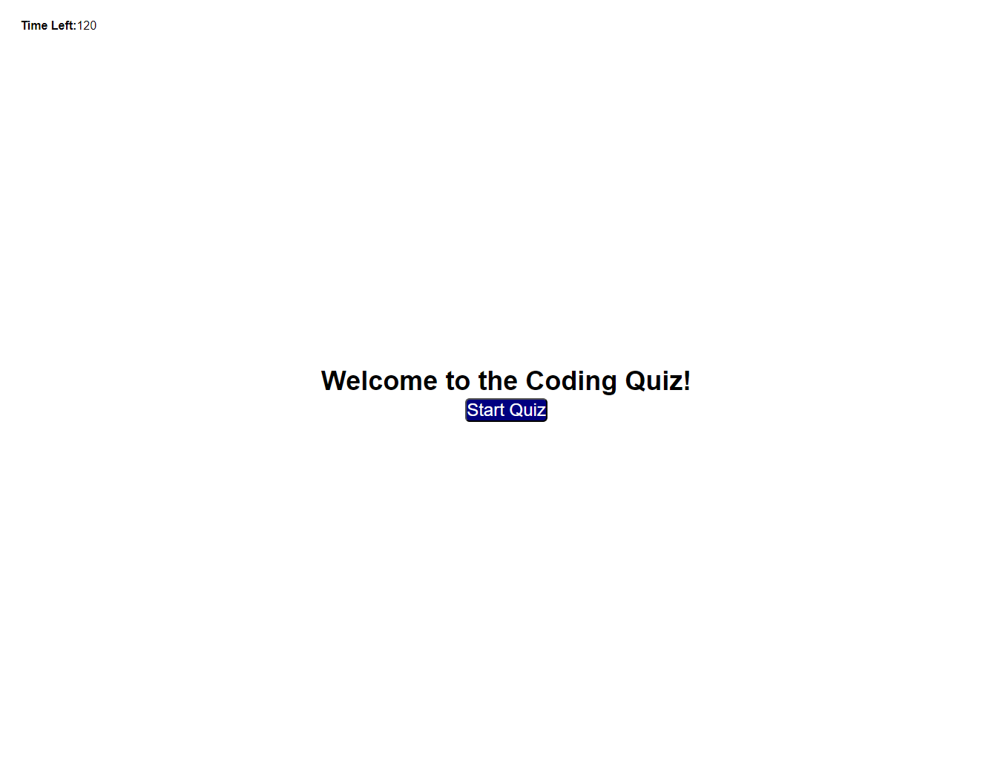

# CodeQuiz

## Description

This Coding Quiz webpage allows the bootcamp students to review basic Javascript concepts.  

This project taught me how to traverse the DOM, utilize timers, create and append new elements to the HTML DOM using Javascript, add and use event listeners, and storing objects on the local storage.  

## Installation

N/A

## Usage
To take the coding quiz, simply visit https://fzhao888.github.io/Code-Quiz/ and click on the start button.  The score is calculated based on the time left.  Enjoy!

Here is a screenshot of the website:

## Credits

HUGE shoutout to TA Chris! Chris assisted me with how to display high scores by adding in list items and the sort function.  He also helped me A TON with the css styling, as that as the part that took the longest and most confusing.  

Shoutout to TA Jessica for helping me setup the HTML and getting me started.  Jessica gave me the idea to use an array where each object stored the question, choices, and answer. 

## License

MIT License